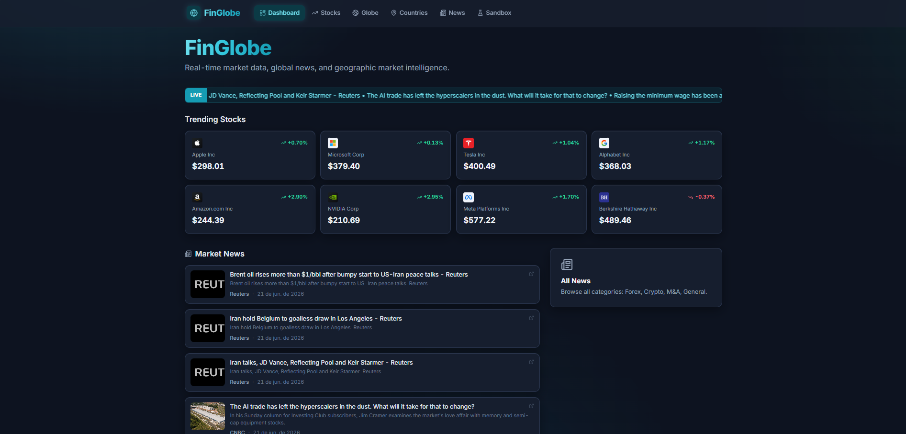
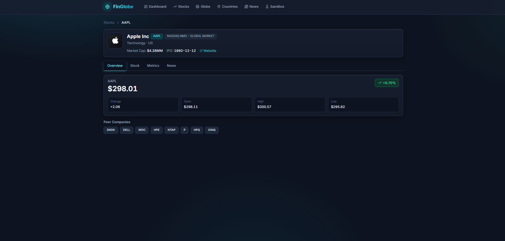
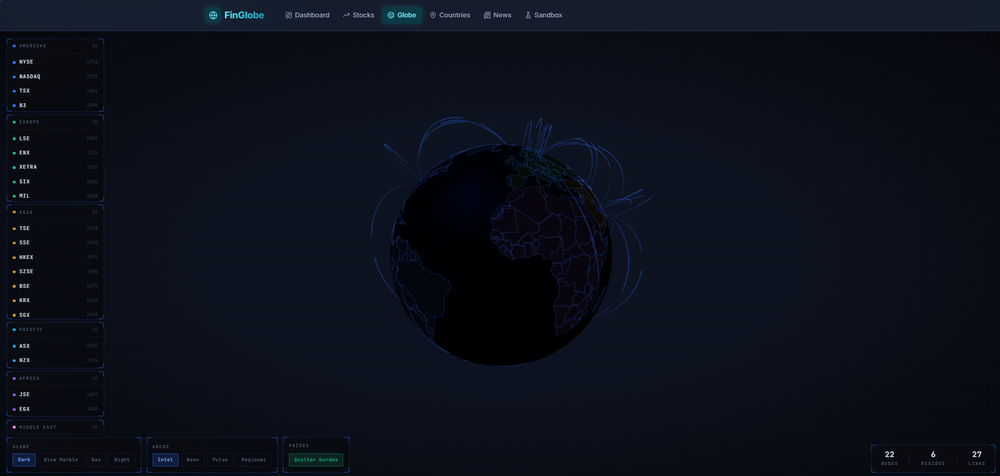
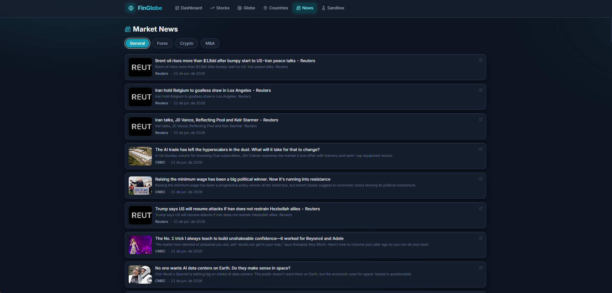
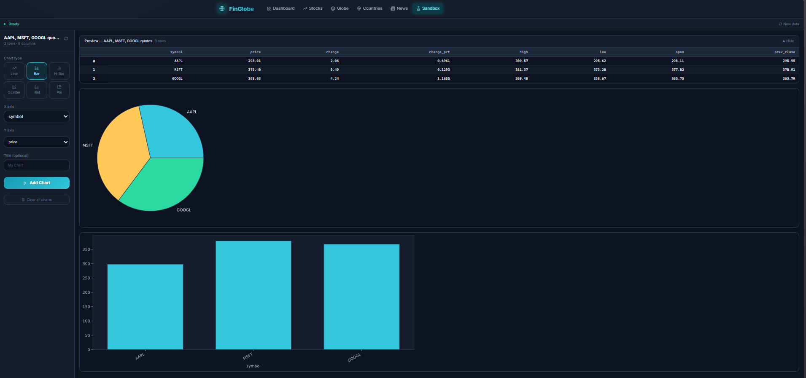

# FinGlobe 🌐

Painel financeiro (dashboard) que reúne **cotações de ações em tempo real, notícias de mercado, inteligência geográfica e um sandbox de análise de dados em Python** — tudo em uma única SPA construída com React + TypeScript + Vite.

Os dados de mercado vêm da [Finnhub](https://finnhub.io/) e os dados de países da [REST Countries](https://restcountries.com/). As chaves de API ficam protegidas por um proxy no servidor de desenvolvimento do Vite (nunca são expostas ao navegador).

<p align="center">
  
</p>

---

## ✨ Funcionalidades

| Página | Rota | O que faz |
|--------|------|-----------|
| **Dashboard** | `/` | Ticker de notícias, ações em alta (*trending*) e feed de notícias gerais do mercado. |
| **Stocks** | `/stocks`, `/stocks/:symbol` | Busca de tickers, cotação em tempo real e gráfico interativo (linha/candlestick) com seleção de período. |
| **Company** | `/company/:symbol` | Perfil da empresa em abas: **Overview**, **Stock** (cotação + gráfico), **Metrics** (indicadores financeiros) e **News**, além de empresas comparáveis (*peers*). |
| **Globe** | `/globe` | Globo 3D interativo (Three.js / three-globe) para visualização geográfica. |
| **Countries** | `/countries-api` | Explorador de dados de países via REST Countries. |
| **News** | `/news` | Notícias por categoria: General, Forex, Crypto e M&A. |
| **Sandbox** | `/sandbox` | Playground de análise de dados em **Python no navegador** (Pyodide) com geração de gráficos a partir de dados de mercado. |

---

## 📸 Capturas de tela

<table>
  <tr>
    <td width="50%"><br/><sub><b>Company</b> — perfil da empresa</sub></td>
    <td width="50%"><br/><sub><b>Globe</b> — globo 3D interativo</sub></td>
  </tr>
  <tr>
    <td><br/><sub><b>News</b> — notícias por categoria</sub></td>
    <td><br/><sub><b>Sandbox</b> — análise de dados em Python</sub></td>
  </tr>
</table>

---

## 🛠️ Stack técnica

- **React 18** + **TypeScript** + **Vite 5**
- **TailwindCSS** para estilização
- **TanStack Query (React Query)** para cache e busca de dados
- **React Router 6** para navegação
- **Recharts** para gráficos de ações
- **Three.js / three-globe** para o globo 3D
- **Leaflet / react-leaflet** para mapas
- **Pyodide** (Python compilado para WebAssembly) no Sandbox

---

## 🚀 Como começar

### Pré-requisitos
- **Node.js 18+** e **npm**

### Instalação

```bash
# 1. Clonar o repositório
git clone https://github.com/JventuraZ/FinancialHub.git
cd financialProject

# 2. Instalar dependências
npm install

# 3. Configurar variáveis de ambiente
cp .env.example .env.local
# edite .env.local e adicione sua chave da Finnhub

# 4. Rodar em modo de desenvolvimento
npm run dev
```


### Configuração das variáveis de ambiente

Copie `.env.example` para `.env.local` e preencha:

| Variável | Obrigatória | Descrição |
|----------|:-----------:|-----------|
| `VITE_FINNHUB_API_KEY` | Recomendada | Chave da Finnhub. Sem ela, o app roda em modo `demo` (dados limitados). Crie uma gratuita em [finnhub.io/register](https://finnhub.io/register). |
| `VITE_USE_MOCK_CANDLES` | Não | `true` (padrão) gera dados de candle sintéticos, pois o endpoint `/stock/candle` é **premium** na Finnhub. Defina `false` após fazer upgrade do plano para usar dados reais. |
| `VITE_COUNTRIES_API_URL` | Não | Endpoint da REST Countries. API pública, não requer chave. |

> ⚠️ **Nunca** faça commit do arquivo `.env.local` — ele já está no `.gitignore`. Apenas o `.env.example` (sem segredos) deve ir para o repositório.

---

## 📜 Scripts disponíveis

```bash
npm run dev       # servidor de desenvolvimento (Vite + HMR)
npm run build     # type-check (tsc) + build de produção em dist/
npm run preview   # pré-visualiza o build de produção localmente
```

---

## 📁 Estrutura do projeto

```
src/
├── components/        # Componentes de UI reutilizáveis
│   ├── company/       # Perfil da empresa (header, métricas, notícias)
│   ├── stock/         # Cotações, gráficos, busca de tickers
│   ├── news/          # Cards e feeds de notícias
│   ├── layout/        # AppShell, Navbar, container de página
│   └── ui/            # Primitivos (Card, Tabs, Badge, Spinner...)
├── pages/             # Páginas roteadas (Dashboard, Stocks, Company, Globe...)
├── hooks/
│   ├── finnhub/       # Hooks de dados (useQuote, useCandles, useMetrics...)
│   └── ui/            # Hooks de UI (useDebounce...)
├── lib/
│   ├── finnhub/       # Cliente de API, endpoints e mocks de candle
│   └── utils/         # Formatação, datas, mappers
├── config/            # env, rotas, configuração do React Query
└── types/             # Tipagens (Finnhub e domínio)
```

---

## 🔌 Sobre as APIs e o proxy

Em desenvolvimento, o `vite.config.ts` define proxies que injetam as chaves de API **no lado do servidor**:

- `/api/finnhub/*` → `https://finnhub.io/api/v1/*` (adiciona o token automaticamente)
- `/api/countries/*` → `https://restcountries.com/v3.1/*`

Isso garante que a chave da Finnhub **não seja embutida no bundle do navegador**. Para um deploy de produção, é necessário um backend/proxy equivalente, já que o proxy do Vite só funciona em modo de desenvolvimento.

---

## ⚠️ Limitações conhecidas

- **Dados de candle são simulados por padrão.** O endpoint real de candles da Finnhub é pago; o app gera candles sintéticas com o mesmo formato da resposta real até que `VITE_USE_MOCK_CANDLES=false` seja definido com um plano premium.
- **O proxy de API é apenas para desenvolvimento.** Um deploy em produção precisa de um proxy próprio para não expor a chave da Finnhub.
- O modo `demo` da Finnhub retorna dados limitados a alguns símbolos.

---


